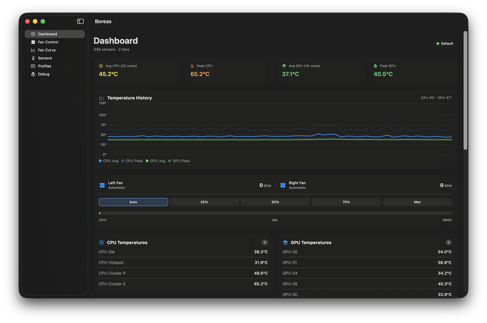
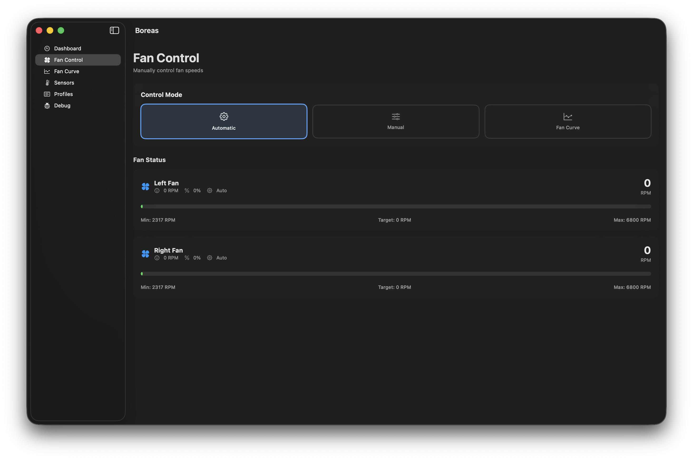
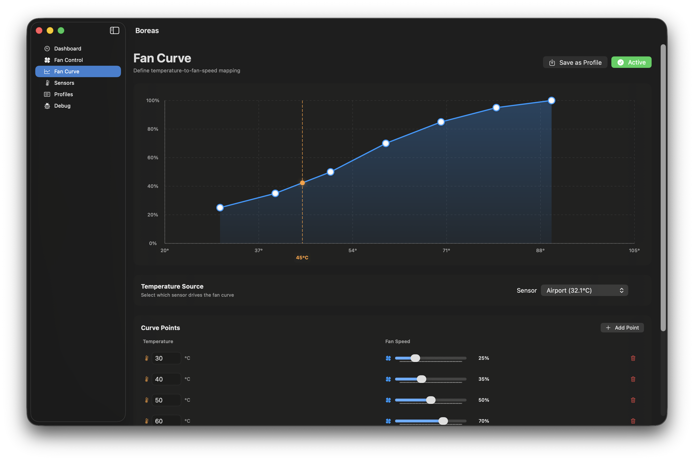
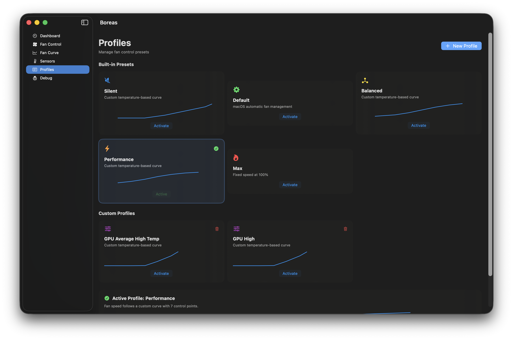
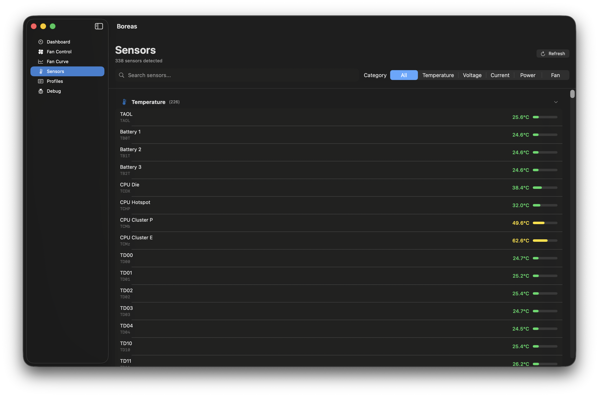

<div align="center">

# Boreas
## macOS Fan Control


</div>

A native macOS desktop application for monitoring system sensors and controlling fan speeds. Built with SwiftUI and direct SMC (System Management Controller) access.

## Features & Screenshots

**Dashboard** — Real-time overview of CPU/GPU temperatures, fan speeds, and power consumption


**Fan Control** — Manual fan speed control with slider and quick presets (0%, 25%, 50%, 75%, 100%)


**Fan Curve Editor** — Visual drag-and-drop curve editor mapping temperature → fan speed with interpolation


**Profiles** — Built-in presets (Silent, Default, Balanced, Performance, Max) and custom profile save/load


**Sensor Monitoring** — Read all available SMC sensors: temperatures, voltages, currents, and power


**Menu Bar** — Quick access to temperatures, fan speeds, and mode switching from the menu bar

## Requirements

- macOS 14.0 (Sonoma) or later
- Xcode 15.0+ for building
- Admin privileges needed **once** to install the root helper (LaunchDaemon) that performs all SMC reads/writes

## Building (fresh clone)

Xcode UI (easiest)
1) Clone: `git clone https://github.com/amansuw/boreas.git && cd boreas`
2) Open: `open Boreas.xcodeproj`
3) Select scheme **Boreas**, destination **My Mac (Apple Silicon/Intel)**
4) Run (⌘R) for Debug, or Product → Archive for Release. The app icon is bundled via `Assets.xcassets` (AppIcon) and the app runs as a background (LSUIElement) menu bar app.

Command line
```bash
git clone https://github.com/amansuw/boreas.git
cd boreas
# Debug
xcodebuild -project Boreas.xcodeproj -scheme Boreas -configuration Debug build
# Release
xcodebuild -project Boreas.xcodeproj -scheme Boreas -configuration Release build
```

Built app locations
- Debug: `~/Library/Developer/Xcode/DerivedData/Boreas-*/Build/Products/Debug/Boreas.app`
- Release: `~/Library/Developer/Xcode/DerivedData/Boreas-*/Build/Products/Release/Boreas.app`

First launch installs the root helper (LaunchDaemon) after prompting for admin password; subsequent runs need no password.

## Running (install-once helper)

1) Launch the app normally. On first launch you will be prompted for your admin password. This installs a LaunchDaemon:

- Plist: `/Library/LaunchDaemons/com.boreas.smchelper.plist`
- Program: `<Boreas.app>/Contents/MacOS/Boreas --smc-daemon`
- IPC: FIFOs at `/tmp/boreas-smc-cmd`, `/tmp/boreas-smc-rsp`, ready file `/tmp/boreas-smc-ready`
- Logs: `/tmp/boreas-daemon.log`

After installation, fan control works **without** further passwords; the daemon auto-starts on boot and the GUI reconnects.

2) If the daemon is already installed, the app will connect without prompting. You can manually restart it:

```bash
sudo launchctl bootout system/com.boreas.smchelper
sudo launchctl bootstrap system /Library/LaunchDaemons/com.boreas.smchelper.plist
```

3) Legacy one-shot helper (not recommended) still exists at `--smc-helper <fifo-dir>` via `osascript`, but the daemon path is preferred.

## Architecture

```
Boreas/
├── BoreasApp.swift          # App entry point, window & menu bar setup
├── SMC/
│   ├── SMCKit.swift          # Low-level SMC interface via IOKit
│   └── SensorDefinitions.swift # Known sensor keys & categories
├── Models/
│   ├── FanCurve.swift        # Fan curve with interpolation
│   └── FanProfile.swift      # Profile presets & custom profiles
├── Managers/
│   ├── SensorManager.swift   # Periodic sensor polling
│   ├── FanManager.swift      # Fan discovery & speed control
│   └── ProfileManager.swift  # Profile persistence (UserDefaults)
└── Views/
    ├── ContentView.swift     # Sidebar navigation
    ├── DashboardView.swift   # Overview with stat cards
    ├── FanControlView.swift  # Manual speed sliders
    ├── FanCurveView.swift    # Visual curve editor with drag points
    ├── SensorListView.swift  # Filterable sensor table
    ├── ProfilesView.swift    # Profile cards & management
    └── MenuBarView.swift     # Menu bar extra
```

## How It Works (Apple Silicon specifics)

- **SMCKit** communicates directly with Apple's SMC via `IOConnectCallStructMethod`
- Reads/decodes SMC data types (`sp78`, `flt`, `fpe2`, etc.)
- **Fan writes require Ftst unlock on Apple Silicon**: `Ftst=1` tells `thermalmonitord` to yield; then writes to `F{n}Md` (mode), `F{n}Tg` (target), and `F{n}Mn` (min). On return to auto, `Ftst=0` restores system control.
- **All fan reads/writes go through the root daemon** for reliable access; GUI uses FIFOs at `/tmp/boreas-smc-*`.
- Fan curves use linear interpolation between user-defined control points.
- Fans reset to macOS automatic control on app quit/reset.

## Safety

- Fans reset to automatic mode on app quit or when you toggle back to Auto (writes `Ftst=0`).
- Warning displayed when manual control is active.
- Built-in profiles provide safe temperature-reactive curves.

## License

See [LICENSE](LICENSE) for details.
